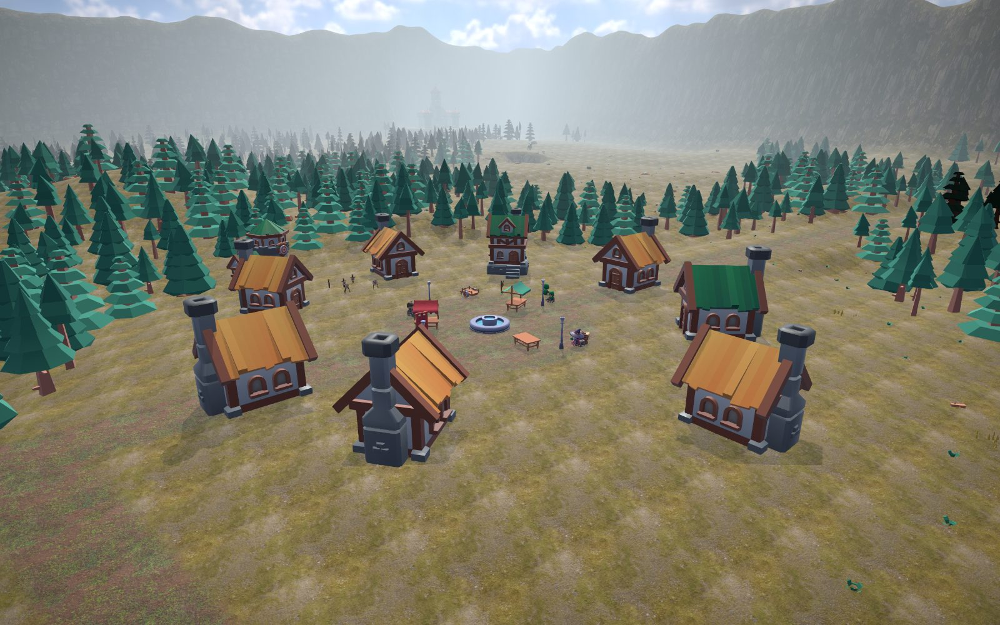
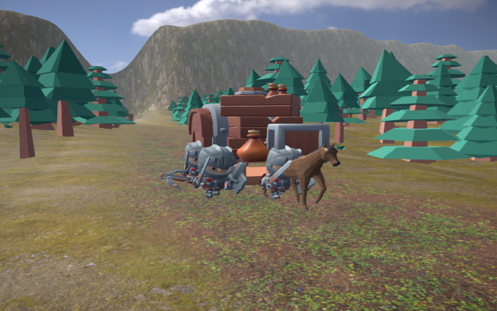
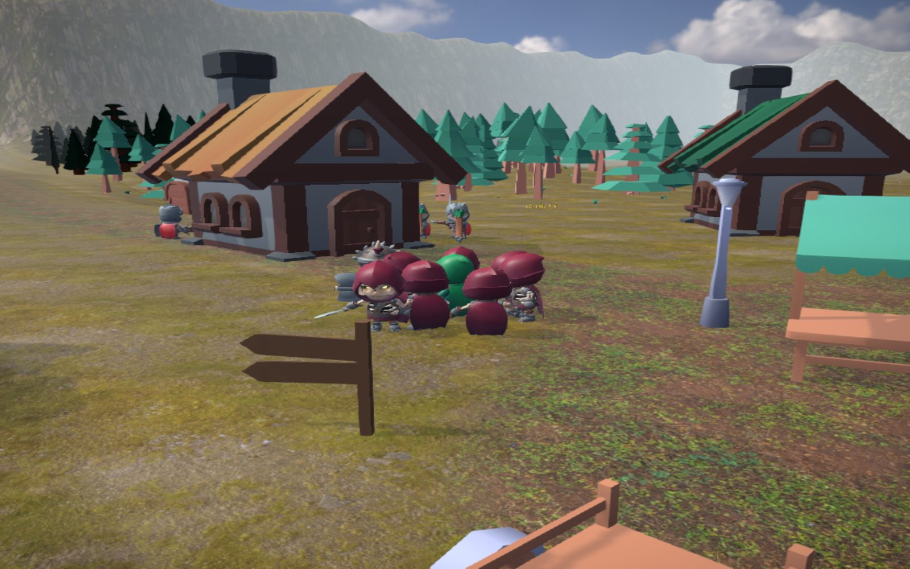
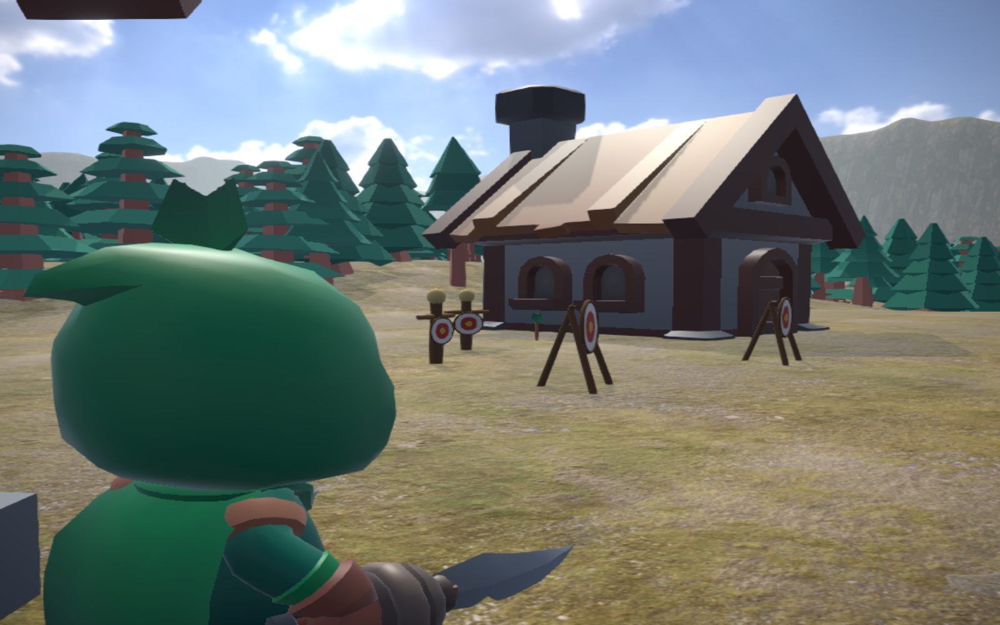
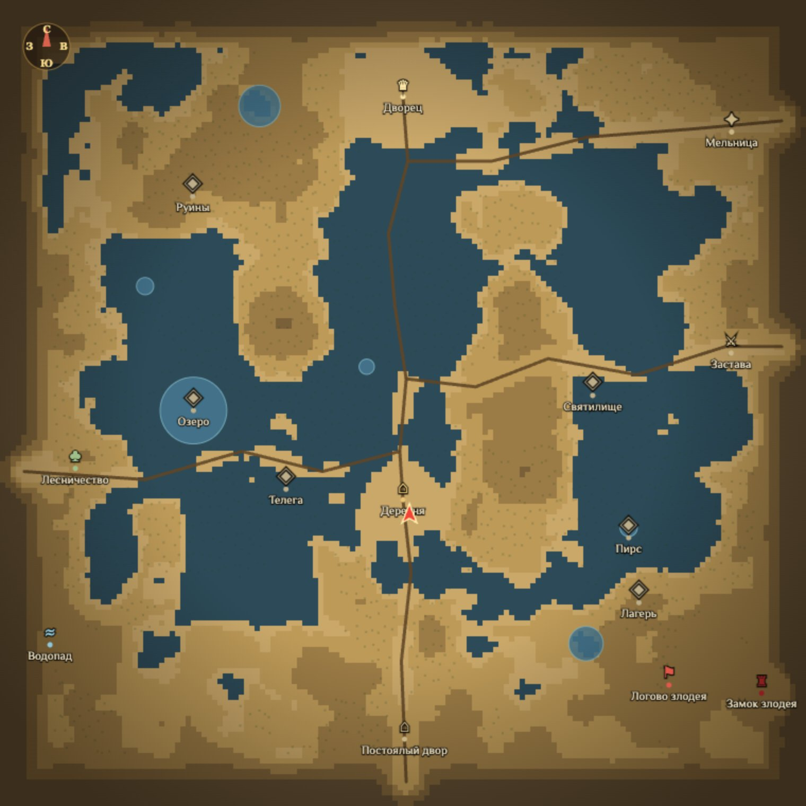
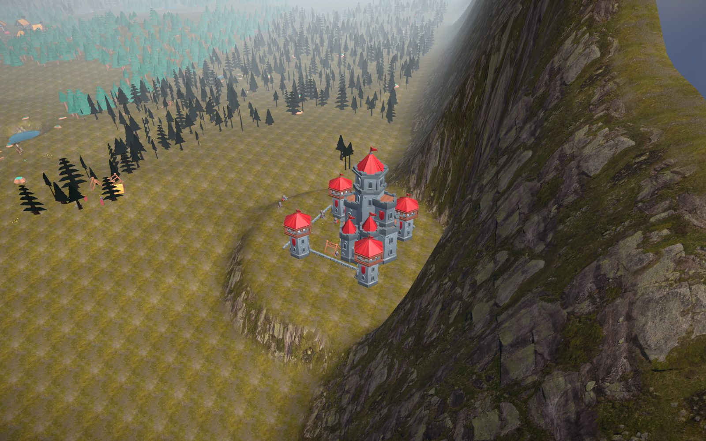

# КОРОВАНЫ

> _«Здраствуйте. Я, Кирилл. Хотел бы чтобы вы сделали игру, 3Д-экшон суть такова…
> Можно грабить корованы… P.S. Я джва года хочу такую игру.»_

Это браузерный 3D-экшен, выросший из самого знаменитого «технического задания»
рунета. В начале 2000-х мальчик Кирилл отправил в игровую студию письмо с
описанием игры мечты: лесные эльфы, деревянные домики, злодей в горном форте и —
самое важное — **возможность грабить корованы**. Письмо стало легендарным мемом.
Спустя двадцать с лишним лет мы взяли это «ТЗ» всерьёз (ну почти) и собрали ту
самую игру — с уважением и доброй усмешкой к первоисточнику.

Вы — лесной эльф. Защищаете деревню от набегов скелетов, устраиваете засады на
корованы посреди тракта, берёте поручения у жителей, прокачиваетесь, охотитесь,
плаваете на лодке и копите силы для схватки со злодеем в горном форте. А деревья
вдали — «картинкой»; подходишь — «преобразовываются в 3-хмерные». Всё как просили.

## 🎮 Играть онлайн

- **GitHub Pages:** https://yunit00.github.io/game-corovans/
- **Зеркало на Netlify:** _(ссылка появится после деплоя)_

> Управление — мышь и клавиатура (см. раздел [«Управление»](#управление)). Нужен
> настольный браузер с поддержкой WebGL2; первая загрузка качает ~40 МБ ассетов.

Игра Telegram-канала **«Точки над ИИ»** — [t.me/TochkiNadAI](https://t.me/TochkiNadAI).
Идеи, баги и впечатления — пишите туда.

## Скриншоты


| | |
|---|---|
|  |  |
| Деревня эльфов | Засада на корован |
|  |  |
| Отражение набега | Стрельба из арбалета |
|  |  |
| Карта мира | Горы и форт злодея |

## Что есть в игре

- **Открытый мир ~1 км².** Seeded-террейн со сплат-шейдером, чанковый лес из
  тысяч сосен с импосторами вдали, сеть дорог, горное кольцо по периметру,
  пруды и ручьи, динамические туман и постпроцессинг.
- **Деревня эльфов и дворец.** Жилые домики, фонтан, рынок, стрельбище,
  патрули. Дома можно потерять в набеге и отстроить заново.
- **Бой ближний и дальний.** Удар кинжалом по сектору и арбалет с режимом
  прицеливания: стрела летит по траектории и втыкается в препятствия.
- **Набеги скелетов.** Волны растущей сложности приходят из форта в горах;
  предупреждение, чип обратного отсчёта и стрелка-наводка на деревню.
- **Грабёж корованов.** Конвои трёх тиров (бедный / купеческий / королевский)
  ездят по тракту под охраной. Засада, бой, фонтан лута — и «heat»: чем чаще
  грабите, тем сильнее охрана следующих корованов и тем вероятнее карательный
  набег.
- **Квесты NPC.** Жители деревни и персонажи на дорогах (лесник, мельник,
  рыбак, квартирмейстер, дозорный, отшельник) дают задания kill / collect /
  visit / deliver с наградами; до четырёх активных квестов сразу.
- **Прокачка и таланты.** Кривая опыта, уровни и дерево из 18 перков с
  развилками по веткам Стрелок / Воин / Следопыт и работающими капстоунами.
- **Экономика и магазин.** Лавка торговца: покупка зелий, оружия, брони и стрел,
  продажа трофеев. Наёмный стражник, баффы у фонтана, слухи у трактирщика.
- **Охота.** Олени и лисы в лесу со своим поведением; трофеи (рога, шкуры, перо)
  продаются в лавке.
- **Паркур по скалам.** Прыжки по естественным выступам горной стены —
  награда ждёт того, кто доберётся до вершины.
- **Сундуки с добычей**, разбросанные по миру для любителей исследовать.
- **Карта мира** по Tab: рельеф, дороги, пруды, лес и маркеры локаций.
- **Финал — злодей в горном форте.** Конечная цель кампании.
- **Сохранения** в localStorage с автосейвом, инвентарь на 24 слота и
  экипировка с видимой сменой модели, средневековая музыка и звук.

## Запуск

Нужен Node.js 20+ (рекомендуется 22, как в `.nvmrc`) и npm.

```bash
npm install
npm run dev      # дев-сервер Vite на http://localhost:5173
```

Готовые к работе ассеты лежат в `public/assets/`, так что для запуска ничего
докачивать не нужно. Скрипты ниже нужны лишь чтобы пересобрать ассеты из
первоисточников (например, обновить или добавить модель):

```bash
npm run assets:fetch     # скачать исходные CC0-ассеты в vendor/
npm run assets:prepare   # сжать и разложить в public/assets/ + манифест
npm run assets:check     # проверить, что обязательные ассеты на месте
```

### Сборка и тесты

```bash
npm run build      # проверка типов (tsc --noEmit) + продакшен-сборка Vite
npm run preview    # локальный предпросмотр собранной версии
npm test           # юнит-тесты (vitest)
npm run typecheck  # только проверка типов
```

## Управление

| Клавиша | Действие |
|---|---|
| WASD | движение |
| Shift | бег |
| Space | прыжок (дважды — двойной прыжок) |
| ЛКМ | удар кинжалом |
| ПКМ (удерж.) | прицел арбалета |
| ЛКМ / F в прицеле | выстрел |
| E | взаимодействие (грабёж, диалог, лавка, ремонт, сесть/выйти из лодки) |
| WASD в лодке | управление лодкой на воде |
| I / P | сумка / таланты |
| Tab | карта мира |
| 1–3 | зелья с пояса |
| Esc | пауза |
| M | звук вкл/выкл |

## Стек

Three.js + Rapier (физика) + TypeScript (strict) + Vite + Vitest.

Чистая игровая логика вынесена в `src/sim/**` и покрыта юнит-тестами, что
позволяет проверять баланс и поведение систем без браузера. Структура исходников:

- `src/core/` — движок: загрузка ассетов, физика, ввод, цикл фиксированного шага;
- `src/world/` — построение мира: террейн, лес, деревня, дворец, дороги, локации;
- `src/entities/` — персонажи, корованы, фауна и их анимации;
- `src/systems/` — AI, камера, бой, набеги, корованы, сейвы;
- `src/sim/` — детерминированная игровая логика (под тестами);
- `src/ui/` — меню, HUD, инвентарь, магазин, карта, экраны прокачки;
- `src/audio/` — музыка, эмбиент, звуковые эффекты.

## Ассеты и лицензии

**Код** распространяется по лицензии [MIT](LICENSE).

**Ассеты лицензией кода не покрываются.** 3D-модели, текстуры, окружение,
музыка и шрифты — сторонние материалы под собственными лицензиями (в основном
CC0 / Public Domain и SIL OFL для шрифтов). Перечень источников:

- Модели: [KayKit](https://kaylousberg.com/) (Kay Lousberg),
  [Kenney](https://kenney.nl/), [Quaternius](https://quaternius.com/) — CC0
- Окружение и HDRI: [Poly Haven](https://polyhaven.com/) — CC0
- Музыка: RandomMind ([OpenGameArt](https://opengameart.org/)) — CC0
- Закадровый голос заставки сгенерирован с помощью [ElevenLabs](https://elevenlabs.io/)
- Шрифты: Forum (Denis Masharov), Philosopher — SIL Open Font License
  (с поддержкой кириллицы)

Скрипт `scripts/fetch-assets.sh` тянет ассеты прямо из первоисточников; точные
ссылки и заметки по лицензиям — в комментариях скрипта.

## Что дальше

Игра уже играбельна от первого набега до финала, но дорожная карта продолжается.
В работе и в планах:

- **Рыбалка** на прудах и ручьях — снасти, улов, спокойный режим между набегами.
- **Больше квестов** и сюжетных цепочек у жителей и дорожных персонажей.
- **Онлайн-лидерборд** — таблица рекордов по награбленному и отражённым набегам.
- **Финальная схватка со злодеем** — доводка боя в горном форте как кульминации
  кампании.
- **Дальнейшая полировка** — баланс, звук, оптимизация и шлифовка интерфейса.

## Дорожная карта

Полный план развития — в [ROADMAP.md](ROADMAP.md).
